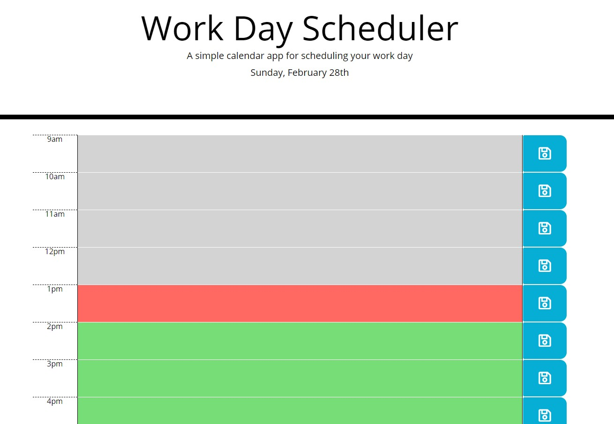

# Work Day Scheduler

## Description
Module 5 weekly challenge assignment. This application is meant to target employees with a busy schedule, that want to keep track of important events throughout the workday to manage their time effectively.

When you first open the daily planner, the current day will be displayed at the top of the calendar. The current day will be broken down into hour increments - based on standard business hours. The time-blocks will be color-coded so that you know whether that event is in the past, present or future. You will be able to click on and edit each event, which will be saved to your local storage so you don't lose your progress on browser refresh.

## Table of Contents
[Installation](https://github.com/savbennett8/work-day-scheduler/#installation)
 
[Usage](https://github.com/savbennett8/work-day-scheduler/#usage)
 
[Contributing](https://github.com/savbennett8/work-day-scheduler/#contributing)
 
[Questions](https://github.com/savbennett8/work-day-scheduler/#questions)

### Installation
There are no dependencies to run this application, but I used Bootstrap, JQuery, and Moment.js to create it.

### Usage
I deployed this application to GitHub Pages; [check it out!](https://savbennett8.github.io/work-day-scheduler/)

### Contributing
If you would like to contribute to this project, feel free!

### Questions
Check out the [repository](https://savbennett8.github.io/work-day-scheduler/) for this project, and [send me an email](mailto:savvy.bennett8@gmail.com) if you have any questions!
